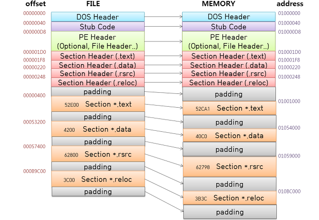
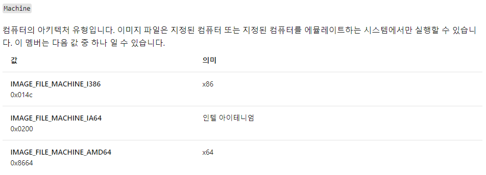

# PE (Portable Executable) 구조
Windows 환경의 실행 파일 포맷.<br>
의식성이 있으면 플랫폼에 독립적.<br>
확장자 (SYS, DLL, SCR, OCX, OBJ 등등)<br><br>

<br>
__*왼쪽의 16진수는 크기를 섹션의 크기를 나타냄*__

PE 순서<br>
> DOS Header<br>
> Stub Code<br>
> PE Header(Optional, File Header)<br>
> Section Header(.text) == 코드를 포함하는 코드 섹션<br>
> Section Header(.data) == 전역 변수 정적 변수를 포함하고 있는 데이터 섹션<br>
> Section Header(.rsrc) == 문자열이나 아이콘 같은 리소스 데이터를 포함하는 리소스 섹션<br>
> Section Header(.reloc) == 실행 파일에 대한 기본 재배치 정보를 담고 있는 섹션<br>
> Padding == 섹션들 사이에 null(\x00)으로 나타나는 부분은 정렬 규칙에 의해 크기를 버리고 처리 효유을 높이기 위해 사용하는 영역.<br>


## IMAGE_DOS_HEADER (구조체 크기 : 0x40 == 64byte)
해당 구조체에 있는 필드의 갯수 : 19개<br>
그 중 e_magic필드와 e_lfanew 필드가 중요하다.<br>

### #e_magic (4D 5A)
PE 파일인지 체크함.<br>
EP(Entry Point)부분부터 2바이트를 차지하며, 4D 5A 값을 가지고 있음.<br>
IMAZE_DOS_SIGNATURE와 비교하여 다르면 PE 파일 구조가 아니라고 함.<br><br>

### #e_lfanew
IMAGE_NT_HEADER의 오프셋을 가짐<br>
가변적인 값을 지님<br>
NT 헤더의 주소는 도스 헤더의 e_lfanew필드를 참조하여 알아 낼 수 있다는 뜻임.<br><br>

## Stub Code
도스 헤더에서 e_lfanew의 크기가 가변적인 이유가 Stub Code 영역 떄문임.<br>
Stub Code는 딱히 신경 안써도 됨<br>

## IMAGE_NT_HEADER
3개의 필드를 지니고 있음<br>
> DWORD Signature;<br>
> IMAGE_FILE_HEADER FileHeader;<br>
> IMAGE_OPTIONAL_HEADER32 OptionalHeader;<br>


### #Signature (DWORD == 4byte)
PE 파일인가를 체크함.<br>
상수 그대로 PE 00 이라는 값을 가지며, 헥사값으로 50 45 00 00의 값임<br>
IMAGE_DOS_HEADER의 e_magic 부분과 IMAGE_NT_HEADER의 Signature를 임의 값으로 수정하여 실행하면 오류남<br>
FileHeader 필드와 OptionalHeader 필드는 구조체 형식이니 구조체 분석에 들어감.<br>

## IMAGE_FILE_HEADER
PE 파일의 기본적인 내용이 담겨있음.<br><br>
> WORD    Machine;<br>
> WORD    NumberOfSections;<br>
> DWORD   TimeDateStamp;<br>
> DWORD   PointerToSymbolTable;<br>
> DWORD   NumberOfSymbols;<br>
> WORD    SizeOfOptionalHeader;<br>
> WORD    Characteristics;<br>


### #Machine
파일이 어떤 CPU에서 동작할 수 있는지 실행할 수 있는 CPU의 타입을 정함.<br>
whinnt.h에 정의된 Machine 상수.<br>
<br>

이 이외에도 더 있음.<br>
```C
#define IMAGE_FILE_MACHINE_UNKNOWN           0 
#define IMAGE_FILE_MACHINE_I386              0x014c  // Intel 386.
#define IMAGE_FILE_MACHINE_R3000             0x0162  // MIPS little-endian, 0x160 big-endian
#define IMAGE_FILE_MACHINE_R4000             0x0166  // MIPS little-endian
#define IMAGE_FILE_MACHINE_R10000            0x0168  // MIPS little-endian
#define IMAGE_FILE_MACHINE_WCEMIPSV2         0x0169  // MIPS little-endian WCE v2
#define IMAGE_FILE_MACHINE_ALPHA             0x0184  // Alpha_AXP
#define IMAGE_FILE_MACHINE_SH3               0x01a2  // SH3 little-endian
#define IMAGE_FILE_MACHINE_SH3DSP            0x01a3
#define IMAGE_FILE_MACHINE_SH3E              0x01a4  // SH3E little-endian
#define IMAGE_FILE_MACHINE_SH4               0x01a6  // SH4 little-endian
#define IMAGE_FILE_MACHINE_SH5               0x01a8  // SH5
#define IMAGE_FILE_MACHINE_ARM               0x01c0  // ARM Little-Endian
#define IMAGE_FILE_MACHINE_THUMB             0x01c2  // ARM Thumb/Thumb-2 Little-Endian
#define IMAGE_FILE_MACHINE_ARMNT             0x01c4  // ARM Thumb-2 Little-Endian
#define IMAGE_FILE_MACHINE_AM33              0x01d3
#define IMAGE_FILE_MACHINE_POWERPC           0x01F0  // IBM PowerPC Little-Endian
#define IMAGE_FILE_MACHINE_POWERPCFP         0x01f1
#define IMAGE_FILE_MACHINE_IA64              0x0200  // Intel 64
#define IMAGE_FILE_MACHINE_MIPS16            0x0266  // MIPS
#define IMAGE_FILE_MACHINE_ALPHA64           0x0284  // ALPHA64
#define IMAGE_FILE_MACHINE_MIPSFPU           0x0366  // MIPS
#define IMAGE_FILE_MACHINE_MIPSFPU16         0x0466  // MIPS
#define IMAGE_FILE_MACHINE_AXP64             IMAGE_FILE_MACHINE_ALPHA64
#define IMAGE_FILE_MACHINE_TRICORE           0x0520  // Infineon
#define IMAGE_FILE_MACHINE_CEF               0x0CEF
#define IMAGE_FILE_MACHINE_EBC               0x0EBC  // EFI Byte Code
#define IMAGE_FILE_MACHINE_AMD64             0x8664  // AMD64 (K8)<br>8t67
#define IMAGE_FILE_MACHINE_M32R              0x9041  // M32R little-endian
#define IMAGE_FILE_MACHINE_CEE               0xC0EE
```


### #NumberOfSections
PE 파일은 코드, 데이터, 리소스 등이 각각의 섹션에 나뉘어서 저장됨.<br>
NumberOfSections는 바로 그 섹션의 개수를 나타냄.<br>
값이 반드시 0보다 커야 함<br>
정의된 섹션 개수와 실제 섹션이 다르면 실행 에러가 발생<br>

### #SizeOfOptionalHeader
SizeOfOptionalHeader의 필드에는 IMAGE_OPTIONAL_HEADER32의 크기가 담김.<br>
IMAGE_OPTIONAL_HEADER32 구조체의 크기는 정해져 있지만, 운영체제마다 크기가 가변적이기에<br>
PE로더가 SizeOfOptionalHeader 필드의 값을 확인하여 IMAGE_OPTIONAL_HEADER 의 크기를 처리함.<br>
PE32+ 형태의 파일의 경우 IMAGE_OPTIONAL_HEADER64 구조체를 사용함.<br>

> IMAGE_DOS_HEADER의 e_lfanew 멤버와 IMAGE_FILE_HEADER의 SizeOfOptionalHeader 멤버 때문에 일반적인 PE 파일 형식을 벗어나는 일명 '꽈배기' PE 파일(PE Patch)을 만들 수 있다고 함.<br>

### #Characteristics
현재 파일의 형식을 알려주는 역할.<br>
실행 가능한 파일인지, DLL 파일인지, 시스템 파일인지, 재배치 여부등에 대한 정보를 가지고 있음.<br>

__*Characteristics 필드 상수*__ <br>
```C
#define IMAGE_FILE_RELOCS_STRIPPED           0x0001  // Relocation info stripped from file.
#define IMAGE_FILE_LINE_NUMS_STRIPPED        0x0004  // Line nunbers stripped from file.
#define IMAGE_FILE_LOCAL_SYMS_STRIPPED       0x0008  // Local symbols stripped from file.
#define IMAGE_FILE_AGGRESIVE_WS_TRIM         0x0010  // Agressively trim working set
#define IMAGE_FILE_LARGE_ADDRESS_AWARE       0x0020  // App can handle >2gb addresses
#define IMAGE_FILE_BYTES_REVERSED_LO         0x0080  // Bytes of machine word are reversed.
#define IMAGE_FILE_32BIT_MACHINE             0x0100  // 32 bit word machine.
#define IMAGE_FILE_DEBUG_STRIPPED            0x0200  // Debugging info stripped from file in .DBG file
#define IMAGE_FILE_REMOVABLE_RUN_FROM_SWAP   0x0400  // If Image is on removable media, copy and run from the swap file.
#define IMAGE_FILE_NET_RUN_FROM_SWAP         0x0800  // If Image is on Net, copy and run from the swap file.
#define IMAGE_FILE_SYSTEM                    0x1000  // System File.
#define IMAGE_FILE_DLL                       0x2000  // File is a DLL.
#define IMAGE_FILE_UP_SYSTEM_ONLY            0x4000  // File should only be run on a UP machine
#define IMAGE_FILE_BYTES_REVERSED_HI         0x8000  // Bytes of machine word are reversed.
```

### #TimeDateStamp
PE 파일이 만들어진 시간.<br>
파일이 빌드된 날짜가 타임스탬프 형식으로 기록<br>
변조가 가능해 신뢰할 값은 아니다.<br>


## IMAGE_OPTIONAL_HEADER (PE 구조체중 가장 큼)
31개의 필드를 가지고 있음<br>
이 중 중요한 일부만 살펴보고, 필요하면 더 공부할 것.<br>


```C
typedef struct _IMAGE_DATA_DIRECTORY {
    DWORD   VirtualAddress;
    DWORD   Size;
} IMAGE_DATA_DIRECTORY, *PIMAGE_DATA_DIRECTORY;
 
typedef struct _IMAGE_OPTIONAL_HEADER {
    WORD    Magic;
    BYTE    MajorLinkerVersion;
    BYTE    MinorLinkerVersion;
    DWORD   SizeOfCode;
    DWORD   SizeOfInitializedData;
    DWORD   SizeOfUninitializedData;
    DWORD   AddressOfEntryPoint;
    DWORD   BaseOfCode;
    DWORD   BaseOfData;
    DWORD   ImageBase;
    DWORD   SectionAlignment;
    DWORD   FileAlignment;
    WORD    MajorOperatingSystemVersion;
    WORD    MinorOperatingSystemVersion;
    WORD    MajorImageVersion;
    WORD    MinorImageVersion;
    WORD    MajorSubsystemVersion;
    WORD    MinorSubsystemVersion;
    DWORD   Win32VersionValue;
    DWORD   SizeOfImage;
    DWORD   SizeOfHeaders;
    DWORD   CheckSum;
    WORD    Subsystem;
    WORD    DllCharacteristics;
    DWORD   SizeOfStackReserve;
    DWORD   SizeOfStackCommit;
    DWORD   SizeOfHeapReserve;
    DWORD   SizeOfHeapCommit;
    DWORD   LoaderFlags;
    DWORD   NumberOfRvaAndSizes;
    IMAGE_DATA_DIRECTORY DataDirectory[IMAGE_NUMBEROF_DIRECTORY_ENTRIES];
} IMAGE_OPTIONAL_HEADER32, *PIMAGE_OPTIONAL_HEADER32;
```


### #Magic
PE 에서는 10B의 값을 가지며 PE+에서는 20B라는 값을 가짐.<br>


### #SizeOfCode
코드 영역의 전체 크기가 이곳에 들어감.<br>
.text 섹션의 크기가 들어감.<br>
SizeOfcode와 Section Header(.text)의 크기가 일치하는지 봐야함<br><br>

### #ImageBase
PE 파일이 메모리에 로드될 때의 시작 주소.<br>
프로세스의 가상 메모리는 0~FFFFFFFF 범위임(32bit 경우), 이 범위에서<br>
EXE,DLL은 user memory 영역인 0~7FFFFFFF 범위에 로딩이 되고,<br>
SYS. 파일은 kernel memory 영역인 80000000~FFFFFFFF 범위에 로딩됨.<br>
일반적으로 EXE 파일의 ImageBase 값은 00400000이고,<br>
DLL파일의 ImageBase 값은 10000000임.<br>
주의 할 점은, 이 주소가 아닌 링커 옵션을 통해서 다른 시작 주소로 바꿀 수 있음.<br>
_PE 로더는 P 파일을 실행시키기 위해 프로세스를 생성하고 파일을 메모리에 로딩한후 EIP 레지스터 값을 ImageBase + AddressOfEntryPoint 값으로 셋팅한다._

### #AddressOFEntryPoint
프로그램이 메모리에서 실행되는 시작 지점, EP(EntryPoint)의 RVA(Relative Virtual Address) 값을 가지고 있음.<br>

> VA(Virtual Address) == 프로세스 가상 메모리의 절대 주소<br>
> RVA(Relative Virtual Address) == 어느 기준 위치(ImageBase)에서 부터의 상대주소<br>
> RVA + ImageBase == VA<br>

### #BaseOfCode
코드 영역이 시작되는 RVA(상대 주소)를 가지고 있음.<br>
BaseOfCode + ImageBase == 실제 코드 영역의 주소임.<br><br>

### #SelectionAlignment, FileAlignment
PE 파일의 Body 부분은 Section으로 나뉘어져 있음<br>
FileAlignment == 파일에서 섹션의 최소단위<br>
SelectionAlignment == 메모리에서 섹션의 최소단위<br>
SelectionAlignment, FileAlignment 의 크기가 같을 수 있고 다를 수도 있음.<br>
파일 / 메모리의 섹션 크기는 반드시 각각  FileAlignment / SelectionAlignment의 배수가 되어야 함.<br>
빈공간은 패딩영역으로 채워짐<br><br>

### #SizeOfImage
PE 파일이 메모리에 로딩되었을 때 전체 크기를 담고 있음.<br>
일반적으로 파일의 크기와 메모리에 로딩된 크기는 다름<br>
_각 섹션의 로딩 위치와 메모리 점유 크기는 섹션 헤더에 정의되어 있음_<br><br>

### #SizeOfHeader
PE 헤더의 전체 크기를 나타냄<br>
이 값 역시 FileAlignment의 배수여야 함.<br>
파일 시작에서 SizeOfHeader Offset 만큼 떨어진 위치에 첫 번째 섹션이 위치함.<br><br> 


### #Subsystem
이 필드를 보고 시스템 드라이버 파일(*.sys)인지, 일반 실행 파일(*.exe, *.dll)인지 구분할 수 있음.<br>
| 값 | 의미 | 비고 |
|:---:|:---:|:---:|
| 1 | Driver File | 시스템 드라이버(예:ntfs.sys)|
| 2 | GUI(Graphic User Interface) 파일 | 창 기반 어플리케이션(예 : notepad.exe)|
| 3 | CUI(Console User Interface) 파일 | 콘솔 기반 어플리케이션(예 : cmd.exe)|

이 이외에도 OS2, POSIX, CE 등과 같은 서브시스템이 존재<br><br>

### #NumberOfRvaAndSizes
이 필드는 IMAGE_OPTIONAL_HEADER32 구조체의 마지막 멤버인 DataDirectory 배열의 개수를 나타냄.<br>
구조체 정의에 IMAGE_NUMBEROF_DIRECTORY_ENTRIES(16)이라고 명시되어 있으나,<br>
PE 로더는 이 필드의 값을 보고 배열의 크기를 인식함<br>
즉, 16이 아닐 수도 있음.<br><br>


### #DataDirectory
IMAGE_DATA_DIRECTORY 구조체의 배열로, 배열의 각 항목마다 정의된 값을 가짐.<br>

```C
#define IMAGE_DIRECTORY_ENTRY_EXPORT          0   // Export Directory
#define IMAGE_DIRECTORY_ENTRY_IMPORT          1   // Import Directory
#define IMAGE_DIRECTORY_ENTRY_RESOURCE        2   // Resource Directory
#define IMAGE_DIRECTORY_ENTRY_EXCEPTION       3   // Exception Directory
#define IMAGE_DIRECTORY_ENTRY_SECURITY        4   // Security Directory
#define IMAGE_DIRECTORY_ENTRY_BASERELOC       5   // Base Relocation Table
#define IMAGE_DIRECTORY_ENTRY_DEBUG           6   // Debug Directory
//      IMAGE_DIRECTORY_ENTRY_COPYRIGHT       7   // (X86 usage)
#define IMAGE_DIRECTORY_ENTRY_ARCHITECTURE    7   // Architecture Specific Data
#define IMAGE_DIRECTORY_ENTRY_GLOBALPTR       8   // RVA of GP
#define IMAGE_DIRECTORY_ENTRY_TLS             9   // TLS Directory
#define IMAGE_DIRECTORY_ENTRY_LOAD_CONFIG    10   // Load Configuration Directory
#define IMAGE_DIRECTORY_ENTRY_BOUND_IMPORT   11   // Bound Import Directory in headers
#define IMAGE_DIRECTORY_ENTRY_IAT            12   // Import Address Table
#define IMAGE_DIRECTORY_ENTRY_DELAY_IMPORT   13   // Delay Load Import Descriptors
#define IMAGE_DIRECTORY_ENTRY_COM_DESCRIPTOR 14   // COM Runtime descriptor

```
IMAGE_OPTIONAL_HEADER의 DataDirectory 필드는 익스포트 디렉터리, 임포트 디렉터리, 리소스 디렉터리, 예외 디렉터리, 보안 디렉터리 영역 등에 접근할 수 있는 주소와 크기를 지니고 있는 배열로,<br>
IMAGE_DATA_DIRECTORY 구조체의 VirtualAddress를 통해 가상 주소를 알 수 있으며, Size를 통해 크기를 알 수 있음.<br>
중요한 값은 EXPORT, IMPORT, RESOURCE, TLS, IAT이고 나중에 알아보도록<br>


## 자료 출처 모음
[PE 구조 자료 출처](https://unabated.tistory.com/entry/PEPortable-Executable-구조)<br>
[IMAGE_FILE_HEADER 구조체 출처](https://docs.microsoft.com/en-us/windows/win32/api/winnt/ns-winnt-image_file_header)<br>
[IMAGE_NT_HEADER 구조체 출처](https://docs.microsoft.com/en-us/windows/win32/api/winnt/ns-winnt-image_nt_headers32)<br>