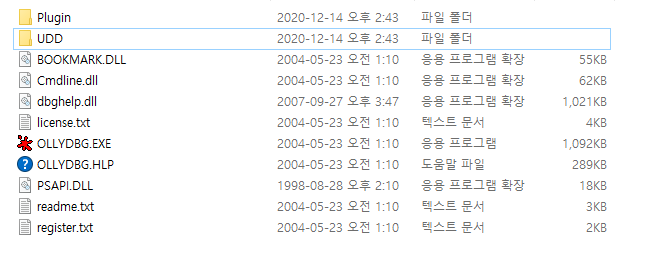

# 리버스 엔지니어링을 하기 위한 초기 셋팅

## 우분투에 환경설정
[우분투에 visual studio code 설정 및 셋팅](https://webnautes.tistory.com/1158) 

## Visual Studio 설치
1. Visual Studio 설치
2. 프로젝트 생성 -> Win32 Application Console -> 빈 프로젝트 생성
3. Win32 Application Console이 없으면 Windows 데스트톱 마법사로 빈프로젝트 exe 생성

## 올리디버거
http://www.ollydbg.de/ 에서 다운 가능  
왼쪽 네비게이션 바에서 Download 항목 클릭, 아래로 스크롤 후  Download OllyDbg 1.10 (final version) 클릭으로 다운. 
압축 파일을 푼 후에, 디렉토리 2개를 생성한다. (Plugin, UDD) 
 
Plugin 디렉토리는 올리디버거의 각종 플러그인을 저장할 디렉토리. 
UDD는 올리디버거에서 브레이크 포인트, 주석 등 작업했던 내용을 저장하게 된다. 
근데 난... 윈10이 막고 있어서 불가능... 
immunity debugger를 사용하기로 했다. 

## Immunity Debugger
[Imminity Debugger Download Path](https://www.immunityinc.com/products/debugger/) 
이곳에서 다운받으면 된다. 
사용법은 뭐... 필요할 때마다 알아가도록 하겠다. 

## 계산기
계산기는 윈10에서 제공하는 기본 공학용 계산기로 사용한다.