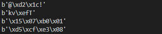
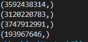
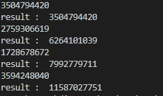
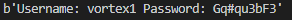

# vortex Level 0 )
#### 문제) 
Your goal is to connect to port 5842 on vortex.labs.overthewire.org and read in 4 unsigned integers in host byte order.<br>
Add these integers together and send back the results to get a username and password for vortex1.<br>
This information can be used to log in using SSH.<br>
#### 문제 풀이) 
Python코드를 이용하여 문제를 해결했다.<br>
소켓을 연결하여 얻어오는 정수 없는 Integer 4개를 더하여 메세지를 보내면, 답을 알려주는 문제라고 설명하고 있다.<br>
네트워크 바이트 오더를 알아야 한다.<br>
Intel x86은 리틀 엔디안 방식을 사용하며, 리틀 엔디언 방식은 메모리의 첫 주소에 하위데이터(데이터의 맨 오른쪽)부터 저장한다.<br>
쉽게 생각하면 받아오는 값을 Big endian으로 변환하고, 계산 후에 다시 Little Endian 방식으로 보내주면 된다.<br><br>

일단 소켓 프로그래밍을 한 후에 어떤 데이터를 받아오는 지 확인했다.(부호 없는 "정수"이기에 4바이트만 받아왔다.)<br>
<br>
반복 실행하니, 값이 바뀌는 것을 확인 할 수 있었다.<br>
즉 받은 즉시 값을 계산하여 보내주지 않으면 답을 얻을 수 없어보인다.<br>
Python Little Endian 이라고 구글에 검색하니, Struct라는 모듈을 추천해주었다.<br>
Struct 모듈의 사용법을 적용한 후 디버깅을 진행했다.<br>
<br>
그림과 같이 튜플 형식으로 받아온다. [0]의 값만 필요하니 추출한 후에 계산.<br>
디버깅으로 값을 잘 계산하는 지 확인했다.<br>
<br>
잘 더해졌으니, Send로 보내면 된다. 값을 계산할 때 빅 엔디언 형식으로 바꿨으니 리틀 엔디언 형식으로 바꾼 후 보내줘야한다.<br>
그랬더니 답이 돌아왔다.
<br>

```python
import socket
import struct

#서버의 주소
HOST = 'vortex.labs.overthewire.org'
# 포트 번호
PORT = 5842

result = 0 # 부호 없는 정수 4개를 더할 변수
big = None # Big Endian을 저장할 변수


#소켓 객체 생성
client_socket = socket.socket(socket.AF_INET, socket.SOCK_STREAM)

#서버에 접속
client_socket.connect((HOST,PORT))

#메세지 4번 수신, 빅엔디언으로 변환 후 데이터 계산
for i in range(0,4):
    data = client_socket.recv(4)
    big = struct.unpack('<I', data)[0]
    result += big
    
    
#리틀 엔디언으로 데이터 변환 후, 메세지 전송
client_socket.send(struct.pack('<I',result))

#답 받아오기
print(client_socket.recv(1024))

# 소켓 닫기
client_socket.close()
```
Struct 객체가 헷갈릴 수 있기에 잠시 설명한다.<br>
Struct 객체에서 받을 때와 보낼 때 모두 Little Endian으로 사용하는 모습이 보인다.<br>
``` python
big = struct.unpack('<I', data)[0] #받을 때 리틀 엔디언 변환

client_socket.send(struct.pack('<I',result)) # 보낼 때 리틀 엔디언 변환
```
오해할 수 있는 부분이, 리틀 엔디언을 빅 엔디언으로 바꿀 때 ">I"로 변환하는 것이 아니다.<br>
그것에 대한 예제를 만들고 실험했다.<br>

``` python
import struct

lUP = struct.unpack("<I",b'\x03\x02\x01\x00')[0]
bUP = struct.unpack(">I",b'\x00\x01\x02\x03')[0]
 
print("Little Endian : "+str(lUP)+"\nBig Endian : "+str(bUP))

lP = struct.pack("<I", lUP)
bP = struct.pack(">I", bUP)

print("Little Endian : "+str(lP)+"\nBig Endian : "+str(bP))

lUP = struct.unpack("<I",lP)[0]
bUP = struct.unpack(">I",bP)[0]

print("Little Endian : "+str(lUP)+"\nBig Endian : "+str(bUP))

```
실행 결과는 이렇다.


#### 답 == _Username: vortex1 Password: Gq#qu3bF3_ 
