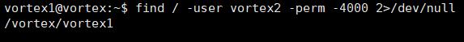

# vortex Level 0 )
#### 문제) 
Your goal is to connect to port 5842 on vortex.labs.overthewire.org and read in 4 unsigned integers in host byte order.<br>
Add these integers together and send back the results to get a username and password for vortex1.<br>
This information can be used to log in using SSH.<br>
#### 문제 풀이) 
Python코드를 이용하여 문제를 해결했다.<br>
소켓을 연결하여 얻어오는 정수 없는 Integer 4개를 더하여 메세지를 보내면, 답을 알려주는 문제라고 설명하고 있다.<br>
네트워크 바이트 오더를 알아야 한다.<br>
Intel x86은 리틀 엔디안 방식을 사용하며, 리틀 엔디언 방식은 메모리의 첫 주소에 하위데이터(데이터의 맨 오른쪽)부터 저장한다.<br>
쉽게 생각하면 받아오는 값을 Big endian으로 변환하고, 계산 후에 다시 Little Endian 방식으로 보내주면 된다.<br><br>

일단 소켓 프로그래밍을 한 후에 어떤 데이터를 받아오는 지 확인했다.(부호 없는 "정수"이기에 4바이트만 받아왔다.)<br>
<br>
반복 실행하니, 값이 바뀌는 것을 확인 할 수 있었다.<br>
즉 받은 즉시 값을 계산하여 보내주지 않으면 답을 얻을 수 없어보인다.<br>
Python Little Endian 이라고 구글에 검색하니, Struct라는 모듈을 추천해주었다.<br>
Struct 모듈의 사용법을 적용한 후 디버깅을 진행했다.<br>
<br>
그림과 같이 튜플 형식으로 받아온다. [0]의 값만 필요하니 추출한 후에 계산.<br>
디버깅으로 값을 잘 계산하는 지 확인했다.<br>
<br>
잘 더해졌으니, Send로 보내면 된다. 값을 계산할 때 빅 엔디언 형식으로 바꿨으니 리틀 엔디언 형식으로 바꾼 후 보내줘야한다.<br>
그랬더니 답이 돌아왔다.<br>
<br>

```python
import socket
import struct

#서버의 주소
HOST = 'vortex.labs.overthewire.org'
# 포트 번호
PORT = 5842

result = 0 # 부호 없는 정수 4개를 더할 변수
big = None # Big Endian을 저장할 변수


#소켓 객체 생성
client_socket = socket.socket(socket.AF_INET, socket.SOCK_STREAM)

#서버에 접속
client_socket.connect((HOST,PORT))

#메세지 4번 수신, 빅엔디언으로 변환 후 데이터 계산
for i in range(0,4):
    data = client_socket.recv(4)
    big = struct.unpack('<I', data)[0]
    result += big
    
    
#리틀 엔디언으로 데이터 변환 후, 메세지 전송
client_socket.send(struct.pack('<I',result))

#답 받아오기
print(client_socket.recv(1024))

# 소켓 닫기
client_socket.close()
```
Struct 객체가 헷갈릴 수 있기에 잠시 설명한다.<br>
Struct 객체에서 받을 때와 보낼 때 모두 Little Endian으로 사용하는 모습이 보인다.<br>
``` python
big = struct.unpack('<I', data)[0] #받을 때 리틀 엔디언에서 빅 엔디언으로 변환

client_socket.send(struct.pack('<I',result)) # 보낼 때 리틀 엔디언 변환
```
오해할 수 있는 부분이, 리틀 엔디언을 빅 엔디언으로 바꿀 때 ">I"로 변환하는 것이 아니다.<br>
그것에 대한 예제를 만들고 실험했다.<br>

``` python
import struct

lUP = struct.unpack("<I",b'\x03\x02\x01\x00')[0]
bUP = struct.unpack(">I",b'\x00\x01\x02\x03')[0]
 
print("Little Endian : "+str(lUP)+"\nBig Endian : "+str(bUP))

lP = struct.pack("<I", lUP)
bP = struct.pack(">I", bUP)

print("Little Endian : "+str(lP)+"\nBig Endian : "+str(bP))

lUP = struct.unpack("<I",lP)[0]
bUP = struct.unpack(">I",bP)[0]

print("Little Endian : "+str(lUP)+"\nBig Endian : "+str(bUP))

```
실행 결과는 이렇다.<br>

<br>

#### 답 == _Username: vortex1 Password: Gq#qu3bF3_ 


# vortex Level 1 )
#### 문제) 
We are looking for a specific value in ptr. You may need to consider how bash handles EOF..

Included file: vortex1.c
```C
#include <stdlib.h>
#include <unistd.h>
#include <string.h>
#include <stdio.h>

#define e(); if(((unsigned int)ptr & 0xff000000)==0xca000000) { setresuid(geteuid(), geteuid(), geteuid()); execlp("/bin/sh", "sh", "-i", NULL); }

void print(unsigned char *buf, int len)
{
        int i;

        printf("[ ");
        for(i=0; i < len; i++) printf("%x ", buf[i]); 
        printf(" ]\n");
}

int main()
{
        unsigned char buf[512];
        unsigned char *ptr = buf + (sizeof(buf)/2);
        unsigned int x;

        while((x = getchar()) != EOF) {
                switch(x) {
                        case '\n': print(buf, sizeof(buf)); continue; break;
                        case '\\': ptr--; break; 
                        default: e(); if(ptr > buf + sizeof(buf)) continue; ptr++[0] = x; break;
                }
        }
        printf("All done\n");
}
```
#### 문제 풀이) 
코드가 주어지면서 ptr의 특정한 값을 찾고 있다고 하네요.<br>
코드에서 보면 알겠듯이 ptr의 시작 부분이 \xca 이면 조건이 만족하여 쉘을 시작하는 것 같습니다.<br>
일단 File을 gdb로 디버깅해보도록 합시다.<br>
<br>
명령어를 입력하고 확인했으나 홈디렉토리에는 아무것도 없군요.<br>
setuid가 걸린 파일을 찾아야합니다. find 명령어로 찾아줬습니다.<br>
<br>
잘 찾았습니다. 해당 디렉토리에 가보면 잘 있음을 확인할 수 있습니다<br>
<br>
gdb를 이용하여 어셈블리어 코드를 살펴봤습니다.<br>
<br>
어셈블리어 코드들 중에 ptr의 시작주소와, 버퍼의 시작주소,그리고 현재 ptr이 가리키고 있는 부분을 찾아야합니다.<br> 
<br>
일단 코드를 보면 buf는 512이라는 공간을 할당했고, dummy가 추가된 공간을 스택에서 확보했습니다.<br>
<br>
그리고 밑에서 eax레지스터에 [esp + 0x1c]가 lea명령어로 주소가 들어감을 알 수 있습니다.<br>
그밑에 add로 eax 변수에 0x100을 더해주는군요. 0x100은 10진수로 256바이트입니다. 그리고 그 값을 [esp + 0x14]부분에 넣어주네요.<br>
필요한 주소는 다 구했습니다.<br>
1. buf의 시작 주소 == esp + 0x1c
2. ptr의 시작 주소 == esp + 0x14
3. ptr이 가리키는 주소 == esp + 0x1c + 0x100<br>

gdb의 명령어중 x/x를 이용해서 확인해 보겠습니다.<br>
<br>
주소를 확인할 때 어느정도 진행이 된 후에 브레이크 포인트를 걸어 주소를 확인해야 정확한 값이 들어가 있어, main+92 부분에 브레이크 포인트를 건 후에 진행했습니다.<br>
<br>
<br>
ptr의 시작 주소는 0xffffd534네요. 0xffffd63c값이 들어가 있는 부분이 보입니다. 여기서 우린 앞의 ff부분을 ca로 바꿔야겠죠.<br>
여기서 리틀 엔디언으로 들어가기 때문에, ff의 위치인 +3 부분에 넣어줘야하겠습니다. 추측이 맞는지 확인해보죠.<br>
<br>
<br>
확실하네요. 자 이곳에 \xca을 넣어주기로 하고, buf의 시작주소를 확인해봅시다.<br>
<br>
buf주소도 찾았으니 ptr이 현재 가리키고 있는 값은 0xffffd53c+100 이고, 이곳에서 ptr의 시작 위치까지 구하려면 (0xffffd53c+100)-0xffffd534 면 거리를 구할 수 있습니다.<br>
264칸 떨어져 있네요. 여기서 주의 할 점은, 우리가 넣을 값의 위치는 esp+14+3에 위치한 곳이었습니다. 264-3을 해주는 공간에 넣어줘야겠네요.<br>
자, 다 구했습니다. 페이로드를 작성하면 됩니다.<br>
_ (python -c 'print "\\" * 261 + "\xca"'; cat) | ./vortex1  _ <br>
이렇게하면 쉘을 획득하실 수 있습니다.<br>
여기서 왜 cat을 넣었느냐에 대한 답변을 문서와 함께 남깁니다. <br>
쉘코드를 사용해서 페이로드를 작성할 때, 파이선 스크립트가 출력하는 과정에서 EOF를 자동으로 추가하기 때문입니다.<br>
[왜 cat이라는 명령어를 넣었는가? - 참고문서](https://satanel001.tistory.com/82)<br>
<br>
페이로드를 넣어주면 쉘코드가 실행되고 password를 얻어올 수 있습니다.<br>


간략한 후기 : Vortex는 풀이에 시간이 걸린다.<br>
Bandit은 linux 다루는데에 초점을 두기에 제외하고, FTZ보다 좀 많이 어려운 것 같다.<br>
그래도 정복 도전!<br>

#### 답 == _23anbT\rE_ 
